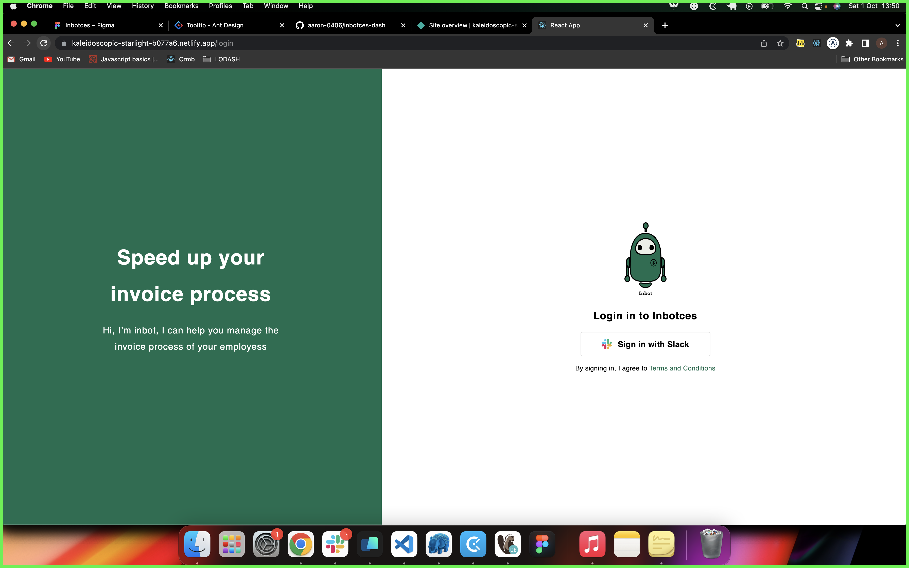
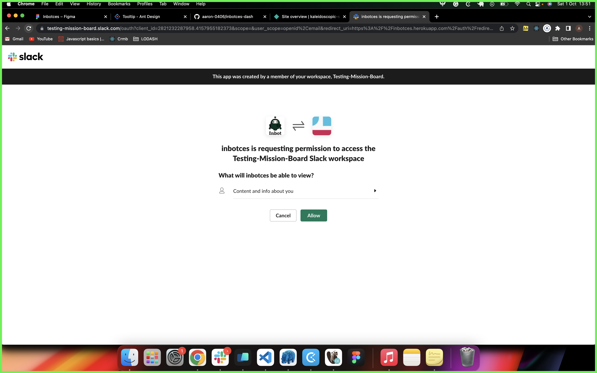
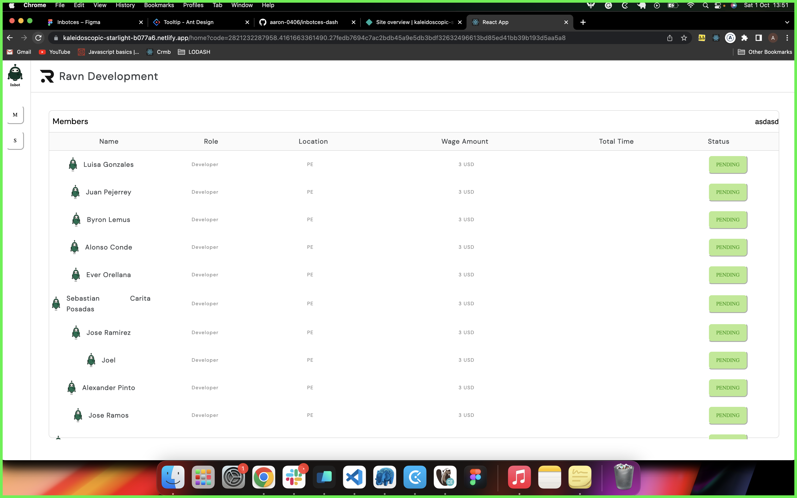
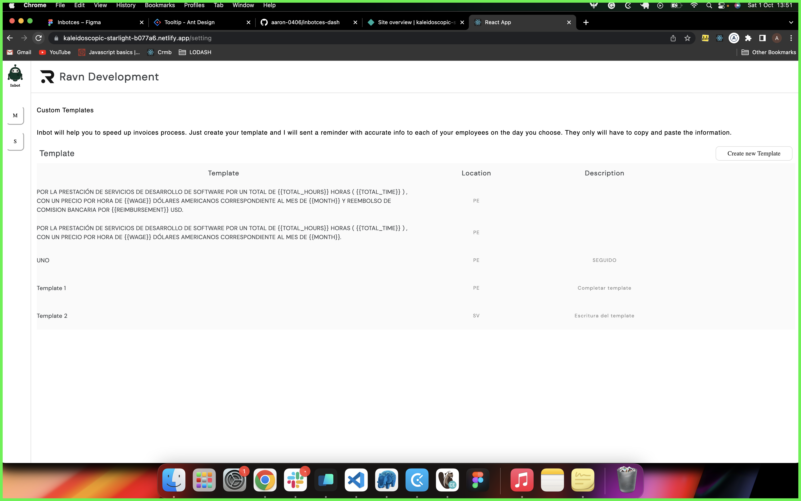
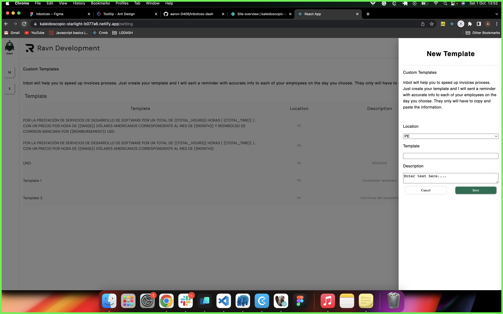

# InBotces

 

 

## 📝 Table of Contents

- [Introduction](#introduction)
- [Concept](#concept)
- [Screens](#screens)

# Introduction 

Welcome to this repository, in this case, you will find the code made by the frontend devs, made with love and dream :).

# Concept 
We dont have concept... For the moment. Good loock.

# Screens
1. Login

 

2. Permissions

 

3. List of Users

 

4. Template

 

5. Template

 

